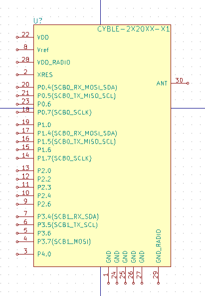

# KiCad - CYBLE2x20XX Library

Footprint and schematic symbol for the CYBLE2X20XX family of modules. [Datasheet](https://www.mouser.com/ds/2/100/002-15631_CYBLE-2X20XX-X1_EZ-BLE_PRoC_XR_Module_Da-1102459.pdf)

### How to use

* **Schematic**: In the schematic editor, go `Preferences > Component Libraries > Add` and select `cyble-2x20xx-x1.lib`
* **Footprint**: In the PCB editor go `Preferences > Footprint Libraries Wizard` and select the `cyble-2x20xx.pretty` folder. You can add it globally or the the current project only.

### Screenshots

### License
This part is available for free without any string attached and WITHOUT WARRANTY OF ANY KIND. Please verify the parts before using.
